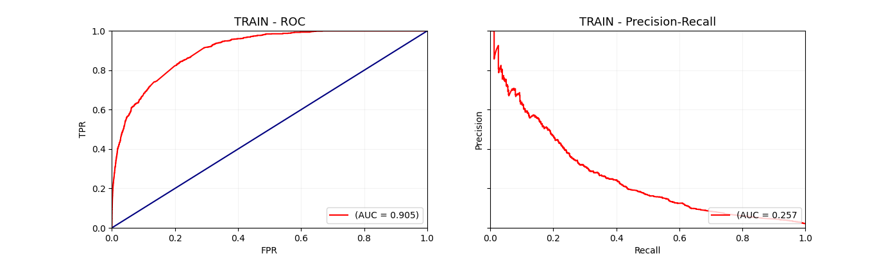

# Credit - Default Predictor

This repository aims to put in place an end-to-end ML development, with CI/CD capabilities. Basically, a model for default prediction will be trained and then dumped to an Amazon S3 bucket. Hence, we will build a Docker container that will be automatically pushed to AWS ECR for further deployment with AWS Lambda.

This is the current structure:

```sh
.
├── Dockerfile
├── Makefile
├── README.md
├── data
│   └── .gitkeep
├── notebooks
│   └── Training.ipynb
├── output
│   ├── distribution_test.png
│   ├── distribution_train.png
│   ├── roc_pr_test.png
│   ├── roc_pr_train.png
│   ├── test_bands.csv
│   └── train_bands.csv
├── requirements.txt
├── serve
│   ├── __init__.py
│   ├── app.py
│   ├── data.py
│   └── predictor.py
├── tests
│   ├── __init__.py
│   ├── conftest.py
│   ├── test_serve
│   │   ├── __init__.py
│   │   ├── test_app.py
│   │   └── test_predictor.py
│   └── test_train
│       ├── __init__.py
│       ├── test_aws.py
│       └── test_model.py
└── train
    ├── __init__.py
    ├── aws.py
    ├── exceptions.py
    ├── main.py
    └── model.py
```

Under `train` we have scripts that gather all the code required for the design, development and evaluation of the model - which is achieved with the help of the script `main.py`, the orchestrator of the whole workflow.

Exploration, preliminary analysis and hyperparameter tuning have been carried out in the file `notebooks/Training.ipynb`. There is also deployment source code under `serve`, where we leverage FastAPI and Mangum (wrapper for FastAPI in AWS Lambda) in order to come up with a first draft of a model that could serve predictions in real time. In order to achieve it, we have used containerization as a strategy, given that we have reproducibility and flexibility ensured throughout the process. In this scenario, we used `docker` and leveraged GitHub Actions with AWS services, in order to have **CI/CD in place**. Basically, every time there is a push to the *main* branch, the pipeline is triggered:

- Dependencies are properly installed;
- Linting is run to automatically detect errors;
- Unit tests are run as well, as best practices;
- Final docker image is built and then pushed to AWS ECR, where it is available to be pulled and used for inference;
- AWS Lambda function is updated with new container.

More on the deployment side will follow below.


### 1. Running instructions for training

If you want to carry out training for this project, please follow the instructions below:

1. Clone this repository:

```sh
git clone https://github.com/gfluz94/aws-deploy-cicd
```

2. Go to the project folder, create a new virtual environment and install dependencies with the help of `Makefile`:

```sh
cd aws-deploy-cicd
python3 -m venv ~/.my-env-name
source ~/.my-env-name/bin/activate
make install
```

3. Execute `train/main.py` with the corresponding flags:

```sh
python3 train/main.py --verbose --calibrate --save-evaluation-artifacts
```

Model artifacts will be dumped to Amazon S3 and evaluation against test set will be not only displayed on screen but also exported to `output/`.

It is worth noting that **there are several flags** to customize the execution. For detailed information, please run:

```sh
python3 train/main.py -h
```


### 2. Deployment

As previously mentioned, there is CI/CD in place in order to test, build and deploy the packaged solution into a productive environment. The strategy is CaaS (Container as a Service), due to several benefits that arise from **microservice deployment**:

- Speed up application development;
- Abstraction from required environment for the application;
- It is easily shareable and reproducible across teams;
- With the advent of container orchestration tools (such as **kubernetes**), it is effiently manageable when several different containerized applications need to run together - which might be the case for credit/fraud policies.

In this mocked example, the image is built and avaible in AWS ECR, which allows it for local use whenever the image is pulled. In a real world scenario, this pushed image would be integrated into one of AWS Services for deployment, such as EKS, EC2 or Lambda, depending upon budget, capacity, redundancy, latency and loading requirements.

In our scenario, for the sake of learning, we are using AWS Lambda, given that is a serverless solution and costs are onyl incurred upon requests. Basically, we have our container stored in Amazon ECR and AWS Lambda fetches it, running upon incoming requests that trigger the function. Amazon API Gateway was chosen to expose the model with an API endpoint, which is protected by an API secret key.


It is possible to test the execution with the following example:

```sh
curl -X 'POST' \
  'https://ioiwc05x26.execute-api.us-east-1.amazonaws.com/default/predict' \
  -H 'accept: application/json' \
  -H 'Content-Type: application/json' \
  -H 'x-api-key: <API_KEY>' \
  -d '{
       "uuid": "1234",
       "max_paid_inv_0_24m": 10.0,
       "avg_payment_span_0_12m": 10.0,
       "sum_capital_paid_account_0_12m": 10.0,
       "time_hours": 10.0,
       "recovery_debt": 10.0,
       "sum_capital_paid_account_12_24m": 10.0,
       "num_active_div_by_paid_inv_0_12m": 10.0,
       "sum_paid_inv_0_12m": 10.0,
       "account_days_in_rem_12_24m": 10.0,
       "num_arch_ok_0_12m": 10.0,
       "account_amount_added_12_24m": 10.0,
       "has_paid": true,
       "account_status": 1.0,
       "account_worst_status_0_3m": 1.0,
       "account_worst_status_3_6m": 1.0,
       "account_worst_status_6_12m": 2.0,
       "account_worst_status_12_24m": 1.0,
       "status_last_archived_0_24m": 1.0,
       "status_2nd_last_archived_0_24m": 1.0,
       "status_3rd_last_archived_0_24m": 1.0,
       "status_max_archived_0_6_months": 1.0,
       "status_max_archived_0_12_months": 1.0,
       "status_max_archived_0_24_months": 1.0,
       "merchant_group": "Entertainment"
    }'
```

Output:

```sh
{"uuid": "1234", "default_probability": 0.23453453928232193, "credit_score": 521.2536138390417}
```

### 3. Analysis Outline

For this particular problem, we have a single data source of single user ids with an incoming transaction along with a label indicating default.

For the sake of simplicity, we have used XGBoost Classifier, since it is a state-of-the-art model that does not need a lot of preprocessing, especially for missing entries. Hence, hyperparameter tuning has been carried out, so that we would have the best performing model available.

Furthermore, since the mais business objective is to use this model as part of existing credit policies, we don't actually need a prediction of dedault, but rather the probability of default. Hence, it is extremely necessary to **calibrate the model** in a way that probabilities resemble the actual fraction of customer who default. Once this is achieved, it is also possible for us to convert it into **credit scores**: the higher the score, the more creditworthy a customer is - which then makes more sense when integrating with policies, since different actions can be targeted, based on the score value.

**Evaluation**

* Classification Metrics - Threshold = 50%:

|Metric    |TRAIN    |TEST     |
|----------|---------|---------|
|Recall    |10%      |5%       |
|Precision |63%      |48%      |
|F1-Score  |18%      |8.5%     |
|ROC-AUC   |0.90     |0.87     |
|PR-AUC    |0.26     |0.15     |


* ROC and PR Curves:




* Credit Score Distributions:


* Score Bands:

(TRAIN)  
|Band      |Band Size|# Default|% Total Population|Band Precision|Cumulative Precision|Cumulative Recall|Cumulative F1-Score|
|----------|---------|---------|------------------|--------------|--------------------|-----------------|-------------------|
|[380, 408)|7        |7        |0.0001            |1.0           |1.0                 |0.01             |0.02               |
|[408, 436)|19       |17       |0.0004            |0.89          |0.92                |0.02             |0.04               |
|[436, 464)|41       |25       |0.001             |0.61          |0.73                |0.05             |0.09               |
|[464, 492)|113      |58       |0.0027            |0.51          |0.59                |0.11             |0.19               |
|[492, 520)|191      |76       |0.0055            |0.4           |0.49                |0.19             |0.27               |
|[520, 548)|292      |60       |0.0098            |0.21          |0.37                |0.25             |0.3                |
|[548, 576)|643      |101      |0.0194            |0.16          |0.26                |0.36             |0.3                |
|[576, 604)|3044     |220      |0.0645            |0.07          |0.13                |0.58             |0.21               |
|[604, 630]|63132    |402      |1.0               |0.01          |0.01                |1.0              |0.02               |


(TEST)  
|Band      |Band Size|# Default|% Total Population|Band Precision|Cumulative Precision|Cumulative Recall|Cumulative F1-Score|
|----------|---------|---------|------------------|--------------|--------------------|-----------------|-------------------|
|[410, 438)|8        |5        |0.0004            |0.62          |0.62                |0.02             |0.04               |
|[438, 466)|6        |2        |0.0006            |0.33          |0.5                 |0.02             |0.04               |
|[466, 494)|21       |9        |0.0016            |0.43          |0.46                |0.05             |0.09               |
|[494, 522)|72       |19       |0.0048            |0.26          |0.33                |0.11             |0.16               |
|[522, 550)|110      |18       |0.0096            |0.16          |0.24                |0.16             |0.19               |
|[550, 578)|235      |33       |0.0201            |0.14          |0.19                |0.27             |0.22               |
|[578, 606)|1204     |92       |0.0736            |0.08          |0.11                |0.55             |0.18               |
|[606, 630]|20838    |144      |1.0               |0.01          |0.01                |1.0              |0.02               |


From an ML-perspective, results are not highly satisfactory, however it might be useful for the business logic within the existing policies.

___

Contact: gfluz94@gmail.com
